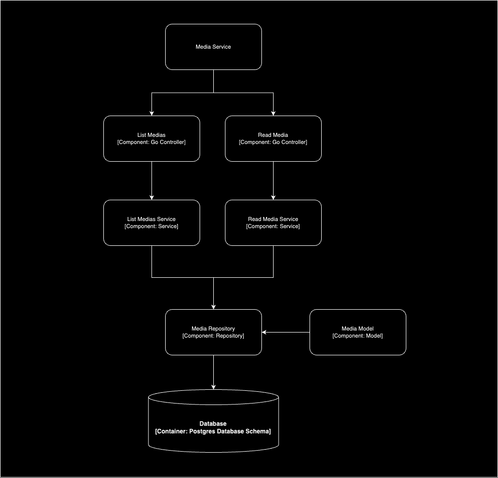

# Chorume-TV Media Server

Este é o projeto do Media Server para a Chorume-TV. Ele será responsável pelo streaming de vídeos. O projeto segue os princípios da Clean Architecture.

## Sumário

- [Visão Geral](#visão-geral)
- [Instalação](#instalação)
- [Configuração](#configuração)
- [Uso](#uso)
- [Camadas do Projeto](#camadas-do-projeto)
- [Diagrama de Arquitetura](#diagrama-de-arquitetura)
- [Contribuição](#contribuição)
- [Licença](#licença)

## Visão Geral

O Chorume-TV Media Server é um serviço de streaming de vídeos desenvolvido em Go, utilizando o Gin Web Framework. O projeto segue a Clean Architecture para garantir que o código seja modular, fácil de testar e manter.

## Instalação

Para instalar as dependências do projeto, execute:

```bash
go mod download
```

## Configuração

Copie o arquivo .env.example para .env e configure as variáveis de ambiente conforme necessário.

## Uso

Para iniciar o servidor, execute:

```bash
go run cmd/api/main.go
```

## Camadas do Projeto

**Controller**

Os controladores lidam com as requisições HTTP e interagem com os casos de uso. Eles são responsáveis por receber as requisições, chamar os casos de uso apropriados e retornar as respostas.

**Usecase**

Os casos de uso contêm a lógica de negócio da aplicação. Eles orquestram a interação entre os controladores e os repositórios, garantindo que as regras de negócio sejam aplicadas corretamente.

**Repository**

Os repositórios lidam com a persistência de dados. Eles são responsáveis por acessar o banco de dados e realizar operações de CRUD (Create, Read, Update, Delete) nas entidades.

**Entity**

As entidades representam os objetos de negócio e suas regras. Elas são estruturas de dados puras que contêm os atributos e métodos relacionados ao domínio da aplicação.

**Database**

A camada de banco de dados gerencia a conexão com o banco de dados e a aplicação de migrations. Ela fornece uma interface para que os repositórios possam acessar os dados.

## Diagrama de Arquitetura



## Contribuição

Contribuições são bem-vindas! Por favor, abra uma issue ou envie um pull request.

## Licença

Este projeto está licenciado sob a Licença MIT. Veja o arquivo LICENSE para mais detalhes.
